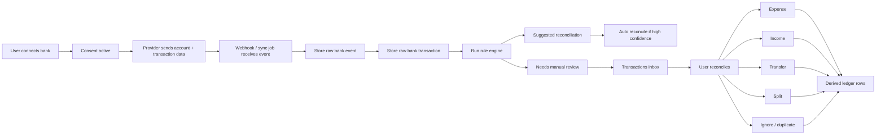
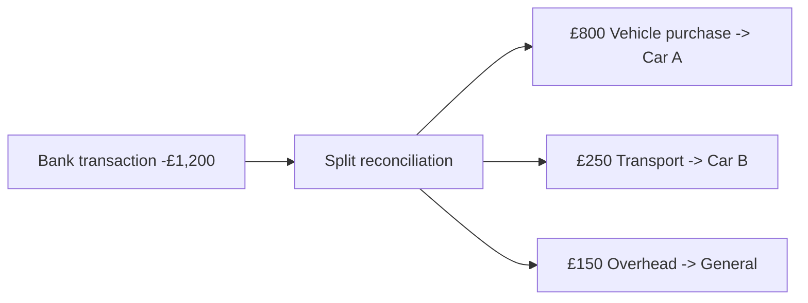
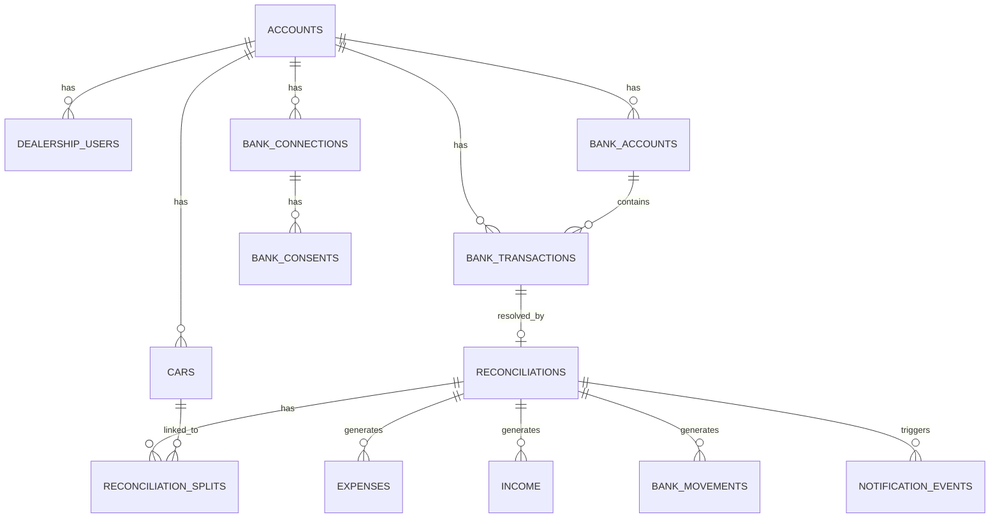

# Pitch Bank: Bank-First Architecture

This rewrite treats the bank feed as the source of truth.

The user should not create most finance entries manually. Instead:

1. A bank account is connected.
2. Raw transactions arrive from the banking provider.
3. Fleet OS stores those transactions unchanged.
4. The app suggests how to reconcile them.
5. The user confirms, edits, splits, transfers, or ignores them.
6. Derived ledger rows are created from the reconciliation decision.

## Core Principle

There are two layers:

- Raw bank feed layer: immutable, provider-sourced, auditable
- Derived business ledger layer: expenses, income, and bank movements created from reconciliation

This avoids the current problem where bank balances are mutated from manual form saves.

## Flow

## Transactions Inbox

The transactions page should become an operational inbox:

- `new`: just arrived, untouched
- `suggested`: rules generated a likely match
- `needs_review`: still unresolved
- `reconciled`: fully handled
- `ignored`: duplicate or irrelevant

The page should be optimized around rapid triage:

- account
- date
- amount
- description/reference
- merchant/counterparty
- suggested category
- current status
- quick actions

## Split Transactions

One raw bank transaction can produce multiple business entries.

Example:

Rules for split reconciliation:

- split totals must equal the original bank transaction amount
- each split line can have its own category, VAT status, and vehicle allocation
- a split can create multiple expenses
- a transfer should usually be a dedicated reconciliation type, not mixed into normal expense lines

## Data Model

## New Source Of Truth

The source of truth should become:

- bank account connection status
- raw bank accounts
- raw bank transactions
- reconciliation state

Not:

- manually keyed expenses and income as the initial record

## Notifications

Each unreconciled incoming transaction can trigger:

- push notification to mobile app
- email reminder if still unreconciled after a delay

Notifications should be driven from the reconciliation state, not directly from the webhook.

## Suggested Rollout

### Phase 1

- Connect bank account
- Ingest raw transactions
- Show uncategorised inbox
- Reconcile as expense, income, transfer, or ignore

### Phase 2

- Add split transactions
- Add merchant/category rules
- Add push and email notifications

### Phase 3

- Auto-reconcile high-confidence items
- Add attachments from mobile during reconciliation
- Add richer vehicle-specific suggestions

## Supabase Setup Strategy

Use the fresh `pitch-bank` Supabase project as the rewrite backend.

Do not try to reuse the old live ledger tables as the main foundation for this version.

The first SQL bootstrap for this rewrite lives in:

- `supabase/pitch-bank/001_bank_first_foundation.sql`
